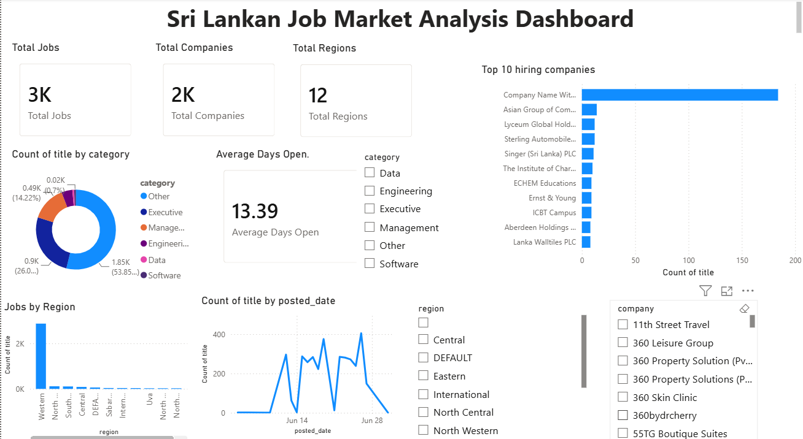

# Sri Lankan Job Market Analysis

## Project Overview

This project analyzes the Sri Lankan job market by scraping job vacancies from TopJobs.lk, cleaning and processing the data, storing it in SQLite, and visualizing hiring trends using Power BI.

---

## Objectives

- Collect job market data automatically
- Clean and transform job data
- Analyze hiring trends
- Build an interactive Power BI dashboard

---

## Technologies

- Python
- BeautifulSoup
- Requests
- Pandas
- SQLite
- Power BI
- Git
- GitHub

---

## Workflow

1. Web Scraping
2. Data Extraction
3. Data Cleaning
4. Database Creation
5. Exploratory Data Analysis
6. Power BI Dashboard

---

## Dashboard

---

## Key Insights

- Most jobs were located in the Western Province.
- IT and Software categories had the highest demand.
- Executive and Manager positions were common.
- Most vacancies remained open for approximately two weeks.

---

## Future Improvements

- Automate daily scraping
- Add salary prediction
- Perform skill extraction using NLP
- Deploy dashboard online

---

## Author

Nipuni Karunanayake